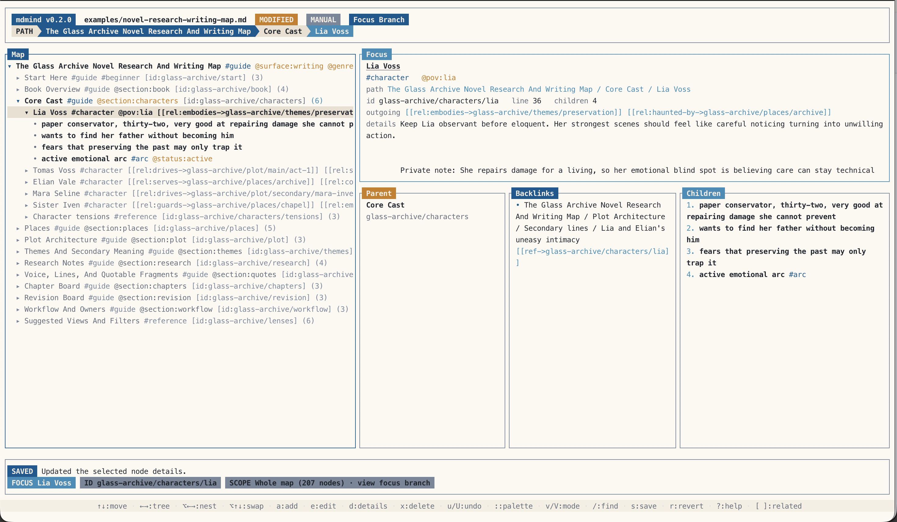

# mdmind

`mdmind` is a local-first thinking tool for structured maps in plain text.

It gives you two interfaces over the same file:

- `mdm`: a CLI for viewing, searching, validating, exporting, and copying examples
- `mdmind`: a full-screen TUI for navigating, filtering, editing, and reshaping maps

The goal is not to mimic a whiteboard app. The goal is to make large idea trees feel calm, searchable, and safe to edit with a keyboard.

License: Apache-2.0



## Why mdmind

`mdmind` is good for:

- product and feature planning
- research and writing maps
- prompt libraries
- project breakdowns
- backlog shaping
- keyboard-first personal planning

It is intentionally not:

- a rich document editor
- a team wiki
- a freeform diagram canvas

## What A Map Looks Like

Maps are plain-text tree files with lightweight inline structure:

- `#tag` for grouping and workflow markers
- `@key:value` for structured metadata
- `[id:path/to/node]` for stable deep links
- `[[target/id]]` or `[[rel:kind->target/id]]` for cross-branch references
- `| detail text` for longer notes attached to a node

Example:

```text
- Product Idea #idea [id:product]
  | Keep the tree label short. Put longer rationale here.
  - Direction #strategy [id:product/direction]
    - CLI-first MVP
  - Tasks #todo @status:active [id:product/tasks] [[prompts/library]]
    - Build parser
    - Ship tests
  - Prompt Library #prompt [id:prompts/library]
```

These files stay readable in normal Markdown tools. `mdmind` adds structure and navigation on top of that plain-text shape.

## Install

For public installs, GitHub Releases are the source of truth.

- macOS:

```bash
brew tap dudash/tap
brew install mdmind
```

- Linux: install from the release tarball
- Windows: install from the release zip

For local development from this repo:

```bash
cargo install --path .
```

That installs both:

- `mdm`
- `mdmind`

More install and release detail lives in [docs/INSTALL_AND_RELEASE.md](docs/INSTALL_AND_RELEASE.md).

## Quick Start

Create a map from a starter template:

```bash
mdm init roadmap.md --template product
```

Open the TUI:

```bash
mdmind roadmap.md
```

Inspect a map from the CLI:

```bash
mdm view roadmap.md
mdm find roadmap.md "#todo"
mdm links roadmap.md
```

Copy bundled example maps onto your machine:

```bash
mdm examples list
mdm examples copy all
```

## Core Ideas

- one plain-text map format, two interfaces
- local-first files with small sidecars for session state, views, checkpoints, navigation memory, and UI settings
- focused views for working inside large maps without losing structure
- built-in search, browse, saved views, ids, relations, and detail notes
- safe editing with undo, redo, checkpoints, and autosave/manual save modes

## Read Next

If you are new:

- [docs/USER_GUIDE.md](docs/USER_GUIDE.md)
- [docs/TUI_WORKFLOWS.md](docs/TUI_WORKFLOWS.md)
- [docs/USING_MDMIND_AS_OUTLINER.md](docs/USING_MDMIND_AS_OUTLINER.md)

If you want specific features:

- [docs/QUERY_LANGUAGE.md](docs/QUERY_LANGUAGE.md)
- [docs/IDS_AND_DEEP_LINKS.md](docs/IDS_AND_DEEP_LINKS.md)
- [docs/CROSS_LINKS_AND_BACKLINKS.md](docs/CROSS_LINKS_AND_BACKLINKS.md)
- [docs/NODE_DETAILS.md](docs/NODE_DETAILS.md)
- [docs/SAFETY_AND_HISTORY.md](docs/SAFETY_AND_HISTORY.md)
- [docs/TEMPLATES.md](docs/TEMPLATES.md)
- [examples/README.md](examples/README.md)

If you want product status and roadmap shelves:

- [docs/product/README.md](docs/product/README.md)
- [docs/product/features/finished/README.md](docs/product/features/finished/README.md)
- [docs/product/features/inwork/README.md](docs/product/features/inwork/README.md)
- [docs/product/features/future/README.md](docs/product/features/future/README.md)

If you are working on the repo:

- [DEVELOPER.md](DEVELOPER.md)
